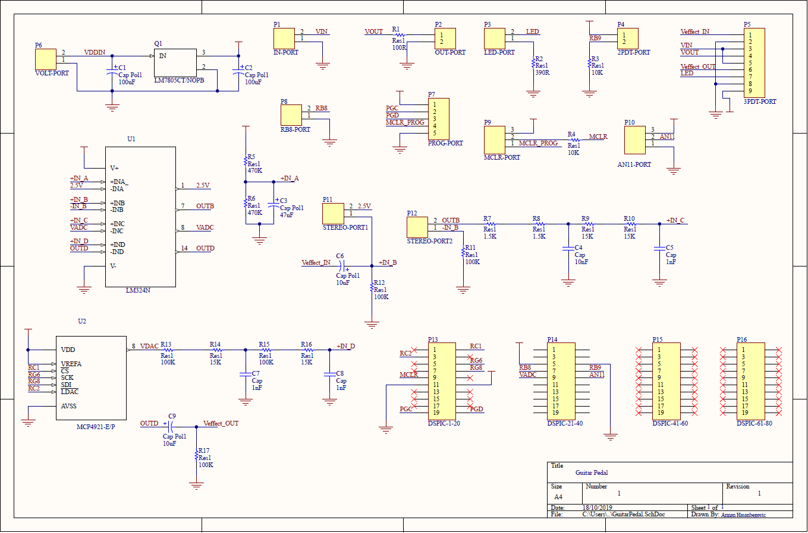
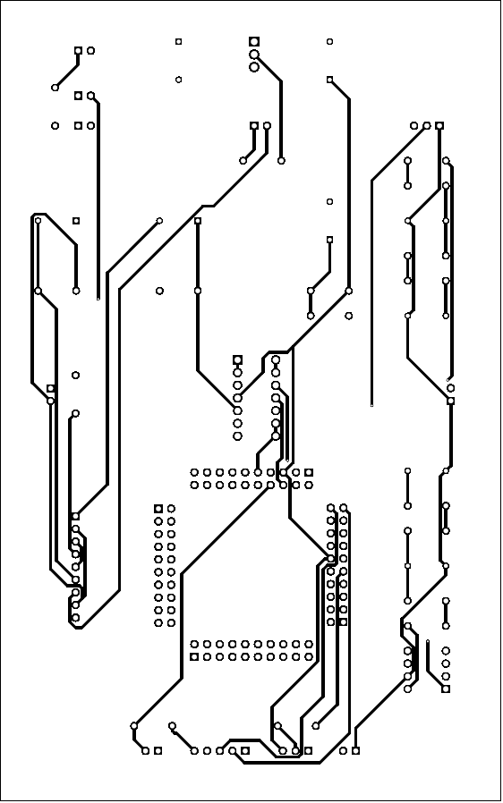
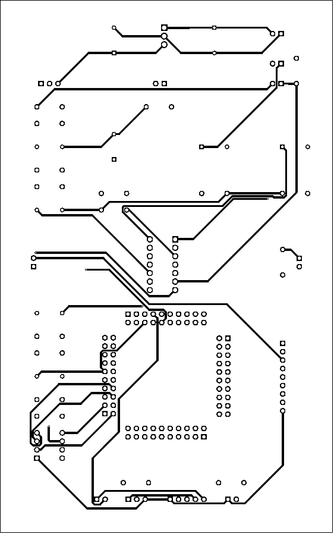
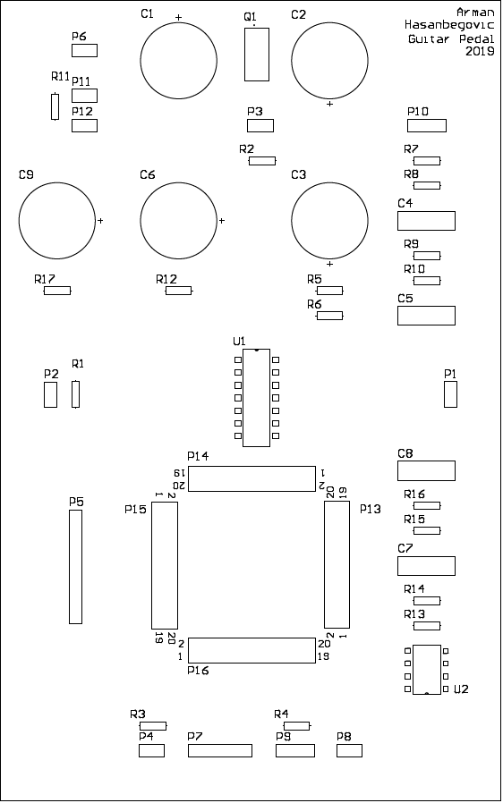

# dspic-guitar-pedal
A dsPIC-based guitar pedal. It is built around a 16-bit DSP microprocessor. The project is designed to showcase some common practices in digital signal processing, PCB design and embedded programming. The A/D and D/A conversions are done using 12-bits, so the lowpass filters are designed to take away a lot of the higher frequencies, which results in a quite unique and dark sound of the pedal when it is on.

## Circuit

The circuit is designed using `Altium Designer v17.1.5 Build 472`. It is based around a breakout board for the dsPIC60F6014A-PF microcontroller designed and sold by Mikroelektronika (see Resources for documentation). Third party models sourced from [SnapEDA](https://www.snapeda.com/home/). All the project files (including the third party models) can be found in the `circuit` directory. The schematic of the circuit is given below.

A two-layer PCB is designed and documented. The top and bottom layers, as well as a preview of the component layout, are given below.

  

Industry-standard output files can be found in `circuit/Project Outputs for GuitarPedal`.

## Code

The code is written using Mikroelektronika `mikroC PRO for dsPIC v7.1.0`. The dsPIC is programmed using a USB programmer designed and sold by Mikroelektronika (see Resources for documentation). The essential code (`template.c`) is written in C and given in the `code` directory. An example of using that code to create a delay effect is given in `delay.c`.

## Resources

[dsPIC30F6014A datasheet](http://ww1.microchip.com/downloads/en/devicedoc/70143e.pdf)

[Mikroelektronika dsPIC PRO4 MCU Card Manual](https://download.mikroe.com/documents/full-featured-boards/easy/dspicpro-v4/dspicpro4-mcu-cards-manual-v100.pdf)

[Mikroelektronika dsPIC Flash Programmer User Manual](http://www.rlx.sk/mikroelektronika/dspicflash_manual_v102.pdf)
